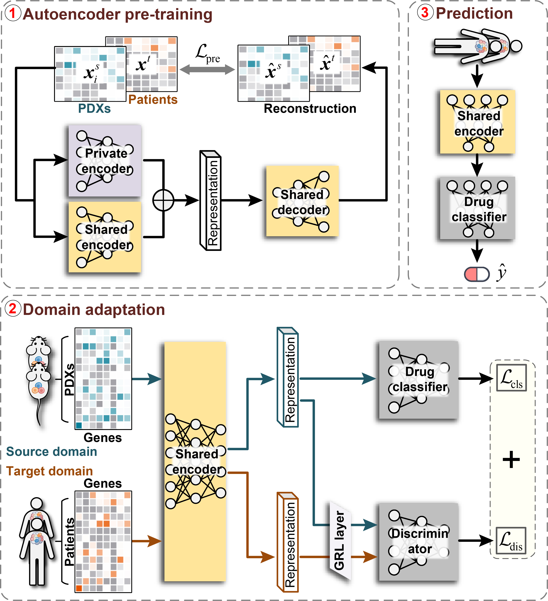

# TRANSPIRE-DRP: A Deep Learning Framework for Translating Patient-Derived Xenograft Drug Response to Clinical Patients via Domain Adaptation

## Introduction

Predicting clinical drug responses remains a central challenge in precision oncology, primarily constrained by limited patient-level pharmacogenomic data and the substantial biological dissimilarity between conventional in vitro models and patient tumors. While patient-derived xenograft (PDX) models offer significantly enhanced tumor biological fidelity compared to cancer cell lines, their computational integration for drug response prediction (DRP) in clinical contexts remains largely underdeveloped. Here, we present TRANSPIRE-DRP, a deep learning framework that bridges the translational gap between PDX models and patients through unsupervised domain adaptation.

This repository contains the source code and datasets for our paper, "TRANSPIRE-DRP: A Deep Learning Framework for Translating Patient-Derived Xenograft Drug Response to Clinical Patients via Domain Adaptation".

## Architecture



## Requirements

The dependencies is the pytorch environment on Linux system, the operating system is Ubuntu Linux release 20.04.5. Some important Python packages are listed below:

- pytorch 1.13.1
- scikit-learn 1.0.2
- numpy 1.21.6
- pandas 1.1.5

```
# Create a virtual environment and install the requirements
conda create -n [ENVIRONMENT NAME] python==3.7.0
conda activate [ENVIRONMENT NAME]
pip install -r requirements.txt
```

## Dataset

1. `./data/gex_features_df.pkl` contains the integrated gene expression profiles from both PDX models (source domain) and patient samples (target domain). The dataset includes 2,358 genes comprising 1,426 highly variable genes and 1,127 established oncogenes, with features normalized through log-transformation followed by gene-level mean centering and standardization. The matrix dimensions are $n \times 2358$, where $n$ represents the total number of samples across both domains.
2. `./data/TCGA_response.tsv` contains the clinical drug response labels for patient samples from TCGA. Response categorization follows standardized Response Evaluation Criteria In Solid Tumors (RECIST) guidelines, where complete response (CR) and partial response (PR) are classified as sensitivity (1), while stable disease (SD) and progressive disease (PD) are designated as resistance (0). The dataset includes 1,100 patient samples with documented clinical outcomes for the corresponding therapeutic agents.
3. `./data/PDXE_response.tsv` contains the drug response labels for PDX samples from the NIBR PDXE dataset. Response labels are determined using modified RECIST criteria (mRECIST), where complete response (mCR), partial response (mPR), and stable disease (mSD) are classified as sensitivity (1), and progressive disease (mPD) as resistance (0). The dataset covers 178 PDX samples across three therapeutic agents: Cetuximab, Paclitaxel, and Gemcitabine.


## Demo

The command line code is:

```bash
python main.py --drug drug_name
```

Description of some important functions and classes:

1. Function `get_unlabeled_dataloaders()` in `data.py` prepares unlabeled genomic data from both PDXE (source domain) and TCGA (target domain) datasets for the pre-training phase.
2. Function `get_lableled_dataloaders_generator()` in `data.py` creates labeled dataloaders for PDX drug response training with cross-validation splits.
3. Function `pretraining.training()` in `main.py` implements the unsupervised representation learning phase using autoencoder architecture to learn domain-invariant genomic representations from both PDX and patient molecular profiles.
4. Function `domain_training.training()` in `main.py` implements the adversarial domain adaptation phase that fine-tunes the pre-trained encoder with focal loss for drug response prediction while aligning PDX and patient domains.

Excepted output: The output files are saved in the `model_save` directory, organized by drug name and parameter configurations. Results include:
- Trained model checkpoints
- `*_val_auroc.txt` and `*_val_auprc.txt`: Validation performance across folds
- `*_test_auroc.txt` and `*_test_auprc.txt`: Test performance on patient samples